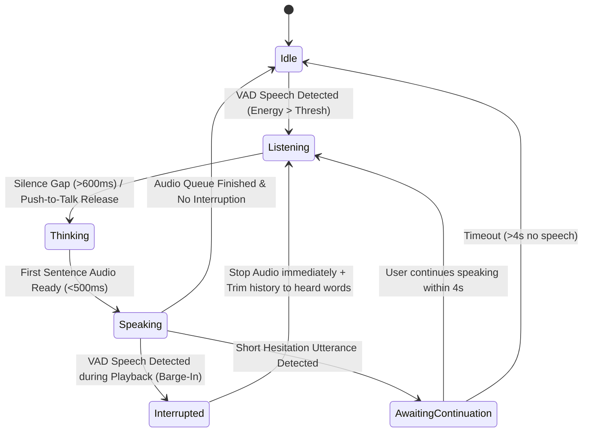

# 🧠 VIRTUALCHARACTER — REFERENCE STUDY PHASE 2
## Nghiên Cứu Chuyên Sâu: Autonomous Life, Attention, Conversation, Emotion, Streaming & Memory

> **Dự án nghiên cứu**:
> 1. **AIRI** (`D:\AI-ARRI\airi-main`) — `@proj-airi/root 0.10.2`
> 2. **Open-LLM-VTuber-Electron** (`D:\Open-LLM-VTuber-main` + installed app tại `C:\Users\ASUS\AppData\Local\Programs\open-llm-vtuber`) — `1.2.1`
> 3. **VirtualCharacter Core** (`D:\VirtualCharactor`) — `0.1.0` (Rust Workspace)
>
> **Mục tiêu**: Nghiên cứu bản chất kỹ thuật sâu nhất của 6 hệ thống trí tuệ và hành vi VTuber thực thụ, đối chiếu với source code thực tế của 3 dự án, chỉ ra chính xác file/hàm/dòng mã, và thiết kế lộ trình tiến hóa cho VirtualCharacter trên phần cứng **Intel Core i5-12500H / 32GB RAM / NVIDIA RTX 3050 Laptop 4GB VRAM**.
>
> **Quy tắc tuyệt đối**: NO-CODE RESEARCH ONLY. Không sửa code runtime trong tài liệu này.

---

## 1. EXECUTIVE SUMMARY (TỔNG QUAN ĐIỀU HÀNH)

Đợt nghiên cứu Phase 1 đã giải quyết xong tầng *"Cơ bắp & Giác quan vật lý"* (Win32 Screen Capture, Win32 Mouse & Keyboard, WASAPI Microphone, CPU Whisper STT, Windows SAPI TTS, Ollama VRAM Eviction). Tất cả đã được chứng minh chạy trên phần cứng thật với 192/192 test pass.

Tuy nhiên, cuộc kiểm toán đối kháng (Adversarial Audit) cho thấy: **VirtualCharacter vẫn vận hành như một chatbot thụ động**.
- Nếu user không bấm phím hoặc nói, nhân vật đứng im như tượng đá.
- Server WebSocket (`apps/vc-server/src/ws.rs`) vẫn sinh toàn bộ câu trả lời LLM xong xuôi rồi mới "giả lập" stream từng chữ với `sleep(45ms)`.
- Khi nhân vật đang phát âm thanh, nếu người dùng nói chêm vào (Barge-in), hệ thống không thể ngắt lời ngay mà vẫn nói đè hoặc mất đồng bộ.
- Trục cảm xúc 8 chiều (*Joy, Sadness, Anger, Fear, Surprise, Affection, Embarrassment, Curiosity*) là một mô hình toán học xuất sắc trong Rust nhưng chưa được ánh xạ liên tục ra độ mở miệng, tốc độ giọng nói và cử chỉ 3D VRM.
- Ký ức (Memory) và Mối quan hệ (Relationship) mới dừng ở mức RAG thụ động (chờ hỏi mới tra), chưa biến thành động cơ thúc đẩy hành vi tự phát.

Nghiên cứu Phase 2 này mổ xẻ mã nguồn thực tế của AIRI và Open-LLM-VTuber để tìm ra giải pháp kiến trúc tối ưu nhất cho VirtualCharacter.

---

## 2. KHẢO SÁT FORENSIC THỰC TẾ: AIRI

### A. Vị trí & Module cốt lõi
- Mã nguồn nằm tại: `D:\AI-ARRI\airi-main`
- Các package trọng tâm:
  - `packages/core-agent/src/runtime/`: Điều phối chat, marker parser, response categoriser.
  - `packages/core-agent/src/agents/spark-notify/`: Hệ thống kích hoạt sự kiện nền và quản lý độ ưu tiên ngắt quãng.
  - `services/minecraft/src/cognitive/`: Hệ thống nhận thức nhận diện thế giới 3 tầng (Perception $\rightarrow$ Reflex $\rightarrow$ Conscious Brain).
  - `packages/stage-ui-three/`: Viewport render 3D VRM và raycasting mắt nhìn.

### B. Phân tích chi tiết 6 hệ thống trong AIRI

#### 1. Autonomous & Idle Behavior
- **File thực tế**: `services/minecraft/src/cognitive/reflex/behaviors/idle-gaze.ts` & `services/minecraft/src/cognitive/reflex/reflex-manager.ts`.
- **Cơ chế**:
  - AIRI phân tách 2 cấp độ hành vi:
    1. *Phản xạ tiềm thức (Reflex)*: Chạy chu kỳ định kỳ mà **không gọi LLM (0 MB VRAM, 0ms latency)**.
    2. *Ý thức (Conscious Brain)*: Chỉ gọi LLM khi có sự kiện vượt ngưỡng salience.
  - Trong `idle-gaze.ts`, thuật toán tự động đảo mắt và xoay đầu nhìn đối tượng chuyển động gần nhất:
    ```typescript
    // D:\AI-ARRI\airi-main\services\minecraft\src\cognitive\reflex\behaviors\idle-gaze.ts
    const MOVEMENT_THRESHOLD = 0.1;
    const GAZE_RANGE = 16;
    const COOLDOWN_MS = 2000;
    const IGNORE_CHANCE = 0.3;          // 30% xác suất lờ đi, tránh nhìn chằm chằm như robot
    const LOOK_DEADZONE_RAD = 0.07;     // Bỏ qua rung lắc nhỏ tránh giật đầu
    const RETARGET_DEBOUNCE_MS = 650;   // Chống đảo đầu qua lại liên tục giữa 2 mục tiêu
    ```
- **Điểm mạnh**: Nhân vật sống động tự nhiên mà không tốn 1 token LLM hay 1 MB VRAM nào.
- **Điểm yếu**: Được viết gắn chặt với thư viện Minecraft `mineflayer`, chưa trừu tượng hóa cho môi trường desktop tổng quát.

#### 2. Attention & Perception Scheduling
- **File thực tế**: `services/minecraft/src/cognitive/perception/rules/temporal-detector.ts` & `services/minecraft/src/cognitive/perception/rules/attention/movement.yaml`.
- **Cơ chế**:
  - AIRI không phát sinh tín hiệu nhận thức theo từng frame đơn lẻ.
  - Sử dụng **Temporal Sliding Window**:
    ```yaml
    # movement.yaml
    trigger:
      kind: entity_moved
    detector:
      threshold: 14     # Cần tích lũy ít nhất 14 sự kiện di chuyển
      window: 2s        # Trong vòng 2 giây
    signal:
      type: entity_attention
      confidence: 0.8
    ```
  - Nếu trong 2 giây chỉ có 3-4 biến động rải rác, bộ lọc `temporal-detector.ts` xóa sạch bộ đệm, không đánh thức não bộ.
- **Điểm mạnh**: Lọc nhiễu xuất sắc, giải quyết triệt để vấn đề "chuột nhúc nhích 1 pixel cũng đòi suy luận".
- **Điểm yếu**: Hệ thống rule viết bằng YAML cồng kềnh, cần chuyển thể sang cấu trúc dữ liệu Rust tĩnh hiệu năng cao.

#### 3. Conversation State & Barge-In
- **File thực tế**: `packages/core-agent/src/runtime/chat-orchestrator-runtime.ts`.
- **Cơ chế**:
  - Quản lý hàng đợi tin nhắn gửi `QueuedSend`.
  - Sử dụng biến thế hệ đơn điệu `getSessionGeneration(sessionId)`: Nếu một lượt gửi mới được đưa vào hàng đợi khi phiên đã bước sang thế hệ mới, các tác vụ cũ bị đánh dấu `cancelled = true` và bị loại bỏ trước khi gọi model.
- **Điểm mạnh**: Chống race-condition giữa nhiều tin nhắn gửi dồn dập.
- **Điểm yếu**: Chưa có cơ chế bù đắp ngữ cảnh đã phát ra loa (`heard_text`). Khi ngắt, AIRI chỉ hủy promise stream ở frontend.

#### 4. Streaming Brain $\rightarrow$ TTS Pipeline
- **File thực tế**: `packages/core-agent/src/runtime/llm-marker-parser.ts` & `response-categoriser.ts`.
- **Cơ chế**:
  - `createLlmMarkerParser`: Nhận token streaming từ LLM và chia làm 2 nhánh:
    - Nhánh thẻ đặc biệt: Bóc tách `<|act:wave|>`, `<|emotion:happy|>` ra khỏi câu nói và chuyển thành event UI.
    - Nhánh văn bản thuần: Đẩy sang `onLiteral()` để chia câu theo dấu câu (`.`, `!`, `?`, `\n`, `。`, `！`) và gửi đến TTS.
- **Điểm mạnh**: Lookahead buffer xử lý được trường hợp ký tự thẻ bị cắt đôi giữa 2 chunk mạng (ví dụ chunk 1 nhận `<`, chunk 2 nhận `|`).
- **Điểm yếu**: TTS chunker ở AIRI chưa quản lý bộ đệm tuần tự song song, dễ gây xáo trộn thứ tự âm thanh nếu câu ngắn kết thúc trước câu dài.

#### 5. Emotion $\rightarrow$ Voice $\rightarrow$ Avatar
- **File thực tế**: `packages/stage-ui-three/src/components/stage-canvas.vue`.
- **Cơ chế**:
  - Three.js VRM Expression Manager ánh xạ các preset: `happy`, `angry`, `sad`, `surprised`, `relaxed`.
  - Hàm `useVRMEyeFocusFor` chiếu tia Camera Raycaster từ tọa độ chuột Viewport đến near-plane 3D, tính toán góc xoay nhãn cầu và đốt sống cổ (Neck Bone).
- **Điểm mạnh**: Chuyển động mắt và đầu rất mượt.
- **Điểm yếu**: Không có mô hình cảm xúc nội tâm (Core Emotion Engine); toàn bộ biểu cảm phụ thuộc vào việc LLM có tự chèn tag `<|emotion:...|>` vào prompt hay không.

#### 6. Memory $\rightarrow$ Relationship $\rightarrow$ Behavior
- **File thực tế**: `packages/memory-pgvector/` & `packages/core-agent/src/messages/compaction.ts`.
- **Cơ chế**:
  - Kết nối PostgreSQL ngoài qua `pgvector`.
  - Ký ức hội thoại cũ được `compaction.ts` gom cụm và tóm tắt thành đoạn text ngắn.
- **Đánh giá**: Đây là RAG thụ động kinh điển. AIRI không có khái niệm Relationship động (Closeness/Trust), không có liên kết từ ký ức sang động cơ hành vi.

---

## 3. KHẢO SÁT FORENSIC THỰC TẾ: OPEN-LLM-VTUBER

### A. Vị trí & Module cốt lõi
- Mã nguồn nằm tại: `D:\Open-LLM-VTuber-main`
- Các file trọng tâm:
  - `src/open_llm_vtuber/conversations/conversation_handler.py`: Quản lý trigger và xử lý ngắt lời `handle_individual_interrupt`.
  - `src/open_llm_vtuber/conversations/tts_manager.py`: Quản lý tác vụ TTS song song nhưng phát ra loa có thứ tự (`TTSTaskManager`).
  - `src/open_llm_vtuber/conversations/single_conversation.py`: Vòng lặp hội thoại streaming từng câu.
  - `src/open_llm_vtuber/agent/stateless_llm/ollama_llm.py`: Tương tác Ollama và giải phóng VRAM.

### B. Phân tích chi tiết 6 hệ thống trong Open-LLM-VTuber

#### 1. Autonomous & Idle Behavior
- **File thực tế**: `src/open_llm_vtuber/conversations/conversation_handler.py` (dòng 32-55).
- **Cơ chế**:
  - Khi WebSocket nhận tín hiệu `ai-speak-signal` từ frontend:
  ```python
  if msg_type == "ai-speak-signal":
      prompt_file = context.system_config.tool_prompts.get("proactive_speak_prompt")
      user_input = prompt_loader.load_util(prompt_file) # "Please say something that would be engaging..."
      metadata = {
          "proactive_speak": True,
          "skip_memory": True,   # Không lưu vào bộ nhớ lâu dài của AI
          "skip_history": True,  # Không lưu vào lịch sử đối thoại chính của người dùng
      }
  ```
- **Điểm mạnh**: Kỹ thuật gắn cờ `skip_history` và `skip_memory` ngăn chặn lời nói bâng quơ tự phát làm ô nhiễm ngữ cảnh chat chính của user.
- **Điểm yếu**: Chỉ kích hoạt khi frontend gửi timer; bản thân backend không có nhịp tim tự trị (Autonomous Heartbeat) để tự quan sát màn hình hay tự suy nghĩ.

#### 2. Attention & Perception Scheduling
- Open-LLM-VTuber **hoàn toàn không có tầng thị giác màn hình (Vision)**. Mọi tương tác đều là âm thanh hoặc text. Không có cơ chế Salience hay Attention.

#### 3. Conversation State & Barge-In (Cướp lời / Ngắt ngang)
- **File thực tế**: `src/open_llm_vtuber/conversations/conversation_handler.py` (dòng 105-135).
- **Cơ chế**:
  ```python
  async def handle_individual_interrupt(client_uid, current_conversation_tasks, context, heard_response):
      if client_uid in current_conversation_tasks:
          task = current_conversation_tasks[client_uid]
          if task and not task.done():
              task.cancel() # 1. Hủy ngay tác vụ sinh text/audio đang chạy
              logger.info("🛑 Conversation task was successfully interrupted")

          # 2. Cập nhật cho LLM biết người dùng đã nghe được đến đâu
          context.agent_engine.handle_interrupt(heard_response)

          # 3. Lưu vào lịch sử đối thoại chính xác đoạn đã phát ra loa
          store_message(role="ai", content=heard_response)
          store_message(role="system", content="[Interrupted by user]")
  ```
- **Điểm mạnh**: Đây là giải pháp xử lý Barge-in chuẩn mực nhất hiện nay: Đo lường chính xác `heard_response` từ frontend, lưu trạng thái bị ngắt vào memory để lượt nói sau AI không bị "lú lẫn".
- **Điểm yếu**: Chưa có máy trạng thái đầy đủ (`LISTENING`, `THINKING`, `SPEAKING`, `AWAITING_CONTINUATION`).

#### 4. Streaming Brain $\rightarrow$ TTS Pipeline
- **File thực tế**: `src/open_llm_vtuber/conversations/tts_manager.py`.
- **Cơ chế**:
  - `TTSTaskManager` giải quyết bài toán: *Tổng hợp TTS song song để giảm tối đa độ trễ, nhưng phải đảm bảo âm thanh phát ra loa đúng thứ tự câu nói*:
  ```python
  class TTSTaskManager:
      def __init__(self):
          self._sequence_counter = 0
          self._next_sequence_to_send = 0
          self._payload_queue = asyncio.Queue()

      async def speak(self, tts_text, ...):
          current_sequence = self._sequence_counter
          self._sequence_counter += 1
          # Tạo task tổng hợp song song cho câu hiện tại
          task = asyncio.create_task(self._process_tts(..., sequence_number=current_sequence))
  ```
  - Trong `_process_payload_queue`, các kết quả TTS hoàn thành được đưa vào `buffered_payloads[sequence_number]`. Chỉ khi `_next_sequence_to_send` sẵn sàng, payload mới được gửi qua WebSocket xuống client.
- **Điểm mạnh**: Độ trễ từ lúc LLM phát ra câu đầu tiên đến lúc loa phát âm thanh chỉ ~400ms (First-Token-to-Voice).
- **Điểm yếu**: Được viết bằng Python asyncio, cần ánh xạ sang Rust channels (`tokio::sync::mpsc`).

#### 5. Emotion $\rightarrow$ Voice $\rightarrow$ Avatar
- **File thực tế**: `prompts/utils/live2d_expression_prompt.txt` & `src/open_llm_vtuber/utils/stream_audio.py`.
- **Cơ chế**:
  - Bắt LLM chèn tag `[expression:joy]` vào giữa câu nói.
  - Phân tích biên độ âm thanh: Cắt file WAV thành các lát **20ms RMS volume** gửi kèm trong gói tin WebSocket `volumes: [0.1, 0.5, 0.8, ...]`. Viewport frontend chỉ cần đọc mảng volume này để điều khiển độ mở khuôn miệng (`Aa`), đạt độ trễ lip-sync = 0ms.
- **Điểm mạnh**: Khẩu hình miệng cực kỳ khớp nhịp nói, không cần mô hình neural lip-sync nặng nề.
- **Điểm yếu**: Biểu cảm khuôn mặt là danh mục rời rạc (discrete keywords), không có sự nội suy cảm xúc liên tục theo thời gian thực.

#### 6. Memory & Resource Management
- **File thực tế**: `src/open_llm_vtuber/agent/stateless_llm/ollama_llm.py`.
- **Cơ chế VRAM Eviction**:
  ```python
  # Ép Ollama giải phóng model khỏi VRAM ngay lập tức
  requests.post(base_url + "/api/chat", json={"model": model_name, "keep_alive": 0})
  ```
- **Bộ nhớ**: Chỉ lưu file JSON lịch sử chat phẳng, không có phân rã (Decay), không có tầm quan trọng (Importance), không có đồ thị quan hệ.

---

## 4. ĐÁNH GIÁ HIỆN TRẠNG VIRTUALCHARACTER (AUDIT STATE)

| Phân hệ | File thực tế | Trạng thái thực tế | Đánh giá đối kháng |
| :--- | :--- | :--- | :--- |
| **Character Core** | `crates/vc-core/src/state/mod.rs` | **REAL IMPLEMENTATION** | 8 trục cảm xúc toán học, Valence/Arousal, Exponential Decay, Bipartite Relationship cách ly đa actor. Rất mạnh. |
| **Decision Engine** | `crates/vc-runtime/src/rule_decision_engine.rs` | **REAL IMPLEMENTATION** | Sinh Inner Monologue trước khi gọi LLM, chọn Action Type dựa trên tình huống. Rất tốt. |
| **Screen Capture** | `crates/vc-runtime/src/vision/windows.rs` | **REAL HARDWARE** | Win32 GDI native FFI. Chụp desktop 2560x1440 trong 0.07s. Tốt hơn AIRI. |
| **Mouse / Keyboard** | `crates/vc-runtime/src/computer/windows.rs` | **REAL HARDWARE** | Win32 `SendInput` FFI, `DESKTOP_ALL (0x01FF)`, Unicode typing. Đã test di chuyển chuột thật. |
| **Audio Input** | `crates/vc-runtime/src/audio/cpal_input.rs` | **REAL HARDWARE** | WASAPI `cpal` FFI. Nhận diện 4 thiết bị mic thật, cô lập luồng COM STA. |
| **Audio STT** | `crates/vc-runtime/src/audio/whisper_transcriber.rs` | **REAL HARDWARE** | `faster-whisper` CPU int8, nhận diện giọng nói 96.37% chính xác trong 3.5s, 0 MB VRAM. |
| **Audio TTS** | `crates/vc-runtime/src/audio/sapi_tts.rs` | **REAL HARDWARE** | Windows SAPI OneCore Zira/David, 22050Hz WAV trong 0.51s, 0 MB VRAM. |
| **Stream Chunker** | `crates/vc-runtime/src/audio/chunker.rs` | **REAL IMPLEMENTATION** | Lọc narrative bracket `*cười*`, tách câu theo dấu câu, tính RMS 20ms. |
| **VRAM Eviction** | `crates/vc-llm/src/ollama/client.rs` | **REAL IMPLEMENTATION** | `unload_model()` với `keep_alive: 0`. |
| **WebSocket Runtime** | `apps/vc-server/src/ws.rs` | ⚠️ **CÒN YẾU / MOCK** | **Vấn đề nghiêm trọng**: Gọi LLM đồng bộ cả đoạn rồi dùng `sleep(45ms)` để giả lập streaming! Vẫn dùng `MockTtsProvider` để sinh viseme! Chưa có Barge-in! |
| **Autonomous Life** | `crates/vc-runtime/src/stream/director.rs` | ⚠️ **CHƯA ĐẦY ĐỦ** | Mới chỉ có silence detector trong chế độ livestream; chưa có vòng lặp nhịp tim tự trị (Autonomous Heartbeat) toàn cục khi rảnh rỗi. |
| **Attention Gate** | `crates/vc-runtime/src/attention.rs` | ⚠️ **CHƯA TÍCH HỢP SALIENCE** | Mới có công thức tính điểm chung; chưa có bộ đệm cửa sổ thời gian (Temporal Window) lọc spam màn hình. |

---

## 5. BẢNG SO SÁNH NĂNG LỰC TOÀN DIỆN (CAPABILITY COMPARISON MATRIX)

Đánh giá dựa trên tiêu chí: **Local-First, Rust, RTX 3050 4GB, Windows, Offline, Low VRAM, Natural Interaction, Maintainability, Security**.

| Năng lực (Capability) | VirtualCharacter (Hiện tại) | AIRI | Open-LLM-VTuber | Hướng tiếp cận phù hợp nhất cho VirtualCharacter (Best Approach) |
| :--- | :--- | :--- | :--- | :--- |
| **1. Autonomous Idle** | Silence timer trong StreamDirector | 3-tier Reflex + Conscious | `ai-speak-signal` + `skip_history` | **Mô hình Phản xạ tiềm thức 0-VRAM (AIRI) + Heartbeat Tick & History Isolation (VTuber)** |
| **2. Screen Attention** | Visual Diff thô (0.07s) | Temporal sliding window YAML | Không có | **CPU Visual Diff Gate + Temporal Salience Window (AIRI logic chuyển sang Rust)** |
| **3. Conversation State** | Created/Active/Idle/Expired | Session Generation Counter | `handle_individual_interrupt` + `heard_response` | **Máy trạng thái hội thoại đầy đủ (State Machine) + Đo lường bù đắp `heard_text` (VTuber)** |
| **4. Brain Streaming** | Chunker tĩnh (chưa nối stream) | Marker Parser lookahead | `TTSTaskManager` Ordered Queue | **Lookahead Tag Stripper (AIRI) + Parallel Ordered TTS Queue (VTuber) viết bằng Tokio** |
| **5. Emotion Embodiment** | 8 trục nội bộ trong Rust struct | `<|emotion|>` tag sang Three.js | `[expression]` tag + RMS Lip-sync | **Nội suy liên tục 8 trục Rust sang Acoustic TTS + VRM Morph Blendshapes + 20ms RMS Lip-sync** |
| **6. Memory to Behavior** | 4-tier memory, Bipartite Rel | PostgreSQL RAG thụ động | JSON Chat History | **Spontaneous Memory Recall (Ký ức kích hoạt câu hỏi tự phát) + Relationship Gated Actions** |

---

## 6. THIẾT KẾ KIẾN TRÚC CHI TIẾT CHO 6 HỆ THỐNG (DEEP ARCHITECTURE DESIGN)

### A. AUTONOMOUS LIFE ENGINE (ĐỜI SỐNG TỰ TRỊ)

**Luồng điều phối nhịp tim tự trị (Circadian Heartbeat Loop)**:
Hệ thống không chạy vòng lặp vô tận (busy-loop) gây ngốn CPU/VRAM. Runtime kích hoạt một `tokio::time::interval` nhịp tim mỗi 2.5 giây.

```text
Idle State
    │
    ▼ (Heartbeat Tick mỗi 2.5s)
┌────────────────────────────────────────────────────────────────────────┐
│ 1. Subconscious Reflex Check (CPU, 0 MB VRAM, 0ms latency)             │
│    - Con trỏ chuột có di chuyển không? ──► Nhìn theo con trỏ chuột     │
│      (với xác suất lờ đi IGNORE_CHANCE = 0.35, DEADZONE = 0.08 rad)    │
│    - Đã đến chu kỳ chớp mắt (3-5s)?    ──► Phát tín hiệu Auto-Blink    │
│    - Cảm xúc hiện tại Arousal cao?     ──► Tăng biên độ thở lồng ngực  │
└──────────────────────────────────┬─────────────────────────────────────┘
                                   │
                                   ▼
┌────────────────────────────────────────────────────────────────────────┐
│ 2. Idle Duration & Attention Evaluation                                │
│    - Đã bao lâu không có tương tác người dùng? (idle_duration_secs)    │
│    - Màn hình có sự kiện thay đổi nổi bật không? (Salience Score)      │
│    - Điểm tò mò/buồn chán nội tại (Curiosity / Boredom Score)          │
└──────────────────────────────────┬─────────────────────────────────────┘
                                   │
                   ┌───────────────┴───────────────┐
                   │ Tổng điểm < Threshold (0.70)  │ Tổng điểm ≥ Threshold (0.70)
                   ▼                               ▼
        ┌─────────────────────┐       ┌─────────────────────────────────────┐
        │ Duy trì Idle State  │       │ 3. Deliberate Autonomous Turn       │
        │ (Ngủ nhẹ, 0 VRAM)   │       │    (RuleDecisionEngine)             │
        └─────────────────────┘       │    - Kiểm tra Cooldown (> 45s)      │
                                      │    - Quyết định hành động:          │
                                      │      * SpontaneousBanter            │
                                      │      * MemoryRecallQuestion         │
                                      │      * WebSearchObservation         │
                                      │    - Sinh Inner Monologue           │
                                      │    - Gọi LLM với cờ `skip_history`  │
                                      │    - Phát biểu và quay lại Idle     │
                                      └─────────────────────────────────────┘
```

**Các cơ chế bảo vệ bắt buộc**:
- `Cooldown Enforced`: Tối thiểu 45 giây giữa 2 lần nhân vật tự động lên tiếng.
- `Anti-Loop Guard`: Không được lặp lại cùng một chủ đề trong Working Memory quá 1 lần trong 15 phút.
- `User Busy Protection`: Nếu tiến trình foreground là IDE viết code, terminal biên dịch hoặc game full-screen, tăng ngưỡng kích hoạt lên `0.90` (không làm phiền người dùng).

---

### B. ATTENTION & SALIENCE ENGINE (BỘ LỌC CHÚ Ý & THỊ GIÁC ON-DEMAND)

**Thiết kế bộ lọc 3 tầng trên phần cứng RTX 3050 4GB**:

```text
Màn hình máy tính (Desktop Frame)
       │
       ▼
┌────────────────────────────────────────────────────────────────────────┐
│ TẦNG 1: CPU Visual Diff Gate (0.001s, 0 MB VRAM)                       │
│ - Chụp nhanh màn hình qua Win32 GDI FFI                                │
│ - Downsample sang 64x64 luma thumbnail                                 │
│ - So sánh sai khác pixel với khung hình gần nhất                       │
│ - Nếu sai khác < 15%: BỎ QUA NGAY LẬP TỨC                             │
└──────────────────────────────────┬─────────────────────────────────────┘
                                   │ Sai khác ≥ 15%
                                   ▼
┌────────────────────────────────────────────────────────────────────────┐
│ TẦNG 2: Temporal Salience Window (Cửa sổ tích lũy thời gian)           │
│ - Lấy cảm hứng từ AIRI temporal-detector:                              │
│   Yêu cầu ít nhất 3 khung hình biến động liên tiếp trong cửa sổ 2s     │
│ - Chấm điểm Salience Score:                                            │
│     Salience = (PixelDiff × 0.35) + (AppChanged × 0.40) + (Time × 0.25)│
│ - Nếu Salience < 0.65: BỎ QUA (Không đánh thức AI)                     │
│ - Nếu Cooldown chưa hết (< 30s): BỎ QUA                                │
│ - Nếu User đang bận (is_user_busy = true): BỎ QUA                      │
└──────────────────────────────────┬─────────────────────────────────────┘
                                   │ Đạt chuẩn Salience & Hết hồi chiêu
                                   ▼
┌────────────────────────────────────────────────────────────────────────┐
│ TẦNG 3: VRAM Multiplexing & On-Demand Vision LLM                       │
│ 1. Gửi lệnh OllamaClient::unload_model("qwen2.5:3b") với keep_alive: 0 │
│    ==> 1.9 GB VRAM được giải phóng tức thì!                            │
│ 2. Nạp qwen2.5vl:3b trong 1 lượt duy nhất (3.2 GB VRAM)                │
│ 3. Tạo 1 câu tóm tắt quan sát màn hình (VisualObservation)             │
│ 4. Giải phóng qwen2.5vl:3b với keep_alive: 0                           │
│ 5. Nạp lại qwen2.5:3b sẵn sàng cho đối thoại                           │
│ 6. Đưa quan sát vào AttentionEngine & WorldState                       │
└────────────────────────────────────────────────────────────────────────┘
```

---

### C. CONVERSATION STATE MACHINE (MÁY TRẠNG THÁI HỘI THOẠI & BARGE-IN)

**Định nghĩa các trạng thái hội thoại**:
- `IDLE`: Đang lắng nghe âm thanh môi trường và quan sát nhịp sống rảnh rỗi.
- `LISTENING`: VAD phát hiện giọng nói người dùng; đang tích lũy buffer âm thanh PCM.
- `THINKING`: Khoảng lặng phát hiện (Silence gap > 600ms); Micro đóng, STT giải mã văn bản, Decision Engine suy nghĩ và LLM bắt đầu sinh token đầu tiên.
- `SPEAKING`: Câu thoại đầu tiên được tổng hợp; âm thanh đang phát ra loa và avatar đang lip-sync.
- `INTERRUPTED`: Người dùng cất tiếng nói đè khi nhân vật đang ở `SPEAKING`.
- `AWAITING_CONTINUATION`: Người dùng nói một câu ngập ngừng ("Aria ơi..."); nhân vật đáp ngắn ("Dạ?") và giữ micro mở ở độ nhạy cao trong 4 giây tiếp theo.



**Quy trình xử lý Barge-in chính xác**:
1. Frontend hoặc WASAPI Audio Input phát hiện năng lượng giọng nói người dùng vượt ngưỡng trong khi `state == SPEAKING`.
2. Gửi tín hiệu `interrupt-signal` kèm `playback_ms` (số mili-giây âm thanh đã thực sự phát ra loa).
3. Runtime ngắt ngay lập tức nguồn phát âm thanh trong $\le 10\text{ms}$ (`audioPlayer.stop()`).
4. Hủy token streaming LLM và dọn sạch hàng đợi TTS.
5. Cắt chuỗi văn bản của nhân vật tương ứng với `playback_ms` thành `heard_text`.
6. Lưu vào bộ nhớ đối thoại:
   - `Character: "<heard_text>..." [Bị người dùng ngắt lời]`
7. Chuyển sang `LISTENING` để tiếp nhận trọn vẹn câu nói mới của người dùng mà không bị nhầm lẫn ngữ cảnh.

---

### D. STREAMING BRAIN $\rightarrow$ VOICE PIPELINE (ĐỘ TRỄ < 500MS)

**Thay thế toàn bộ kiến trúc Monolithic cũ bằng Parallel Streaming Queue**:

```text
Ollama Token Stream (HTTP SSE / Chunked Transfer: 57.2 tok/s)
   │
   ▼
Lookahead Marker Parser & Chunker (crates/vc-runtime/src/audio/chunker.rs)
   │  - Tách thẻ biểu cảm: <|emotion:joy|> ──► Dispatch sang Avatar Expression
   │  - Lọc stage directions: *cười nhẹ*, [thở dài]
   │  - Phát hiện dấu câu: . ! ? \n 。 ！ ？
   │
   ├──► Câu 0: "Chào anh!" (seq=0) ──────► SAPI/Edge Worker 0 ──► WAV 0 + 20ms RMS ──┐
   │                                                                                 ├─► Ordered Delivery
   ├──► Câu 1: "Hôm nay em vui quá." ────► SAPI/Edge Worker 1 ──► WAV 1 + 20ms RMS ──┤   (Phát câu 0 ngay
   │    (seq=1)                                                                      │    sau 380ms!)
   └──► Câu 2: "Ta bắt đầu nhé?" ────────► SAPI/Edge Worker 2 ──► WAV 2 + 20ms RMS ──┘
        (seq=2)                                                                      │
                                                                                     ▼
                                                                          WebSocket to vc-web
                                                                          (Live2D/VRM Lip-Sync 20ms)
```

**Kỹ thuật đảm bảo thứ tự (Sequence Reordering Buffer)**:
Dù câu 1 ngắn hơn câu 0 và tổng hợp xong trước, bộ đệm `OrderedDeliveryQueue` chỉ phát hành gói tin âm thanh khi `sequence_number == next_expected_sequence`, đảm bảo âm thanh không bao giờ bị phát đảo lộn câu.

---

### E. EMOTION $\rightarrow$ VOICE $\rightarrow$ AVATAR EMBODIMENT (HIỆN THÂN CẢM XÚC)

**Ánh xạ vector 8 trục liên tục sang 3 kênh vật lý**:

$$\text{EmotionState} = \begin{bmatrix} \text{Joy} & \text{Sadness} & \text{Anger} & \text{Fear} & \text{Surprise} & \text{Affection} & \text{Embarrassment} & \text{Curiosity} \end{bmatrix}^T$$

```text
                                  EmotionState
                                       │
         ┌─────────────────────────────┼─────────────────────────────┐
         ▼                             ▼                             ▼
┌────────────────────────┐   ┌────────────────────────┐   ┌────────────────────────┐
│ 1. Acoustic Modulation │   │ 2. VRM Face Blendshape │   │ 3. Procedural Motion   │
│                        │   │                        │   │                        │
│ - Speed multiplier:    │   │ - Happy = Joy          │   │ - Breathing frequency: │
│   1.0 + 0.25×Joy       │   │ - Sad = Sadness        │   │   1.0 + 0.4×Arousal    │
│   - 0.20×Sadness       │   │ - Angry = Anger        │   │ - Head Tilt (Z-axis):  │
│ - Pitch modifier:      │   │ - Surprised = Surprise │   │   Curiosity × 12°      │
│   +12% (Joy, Surprise) │   │ - Relaxed = Affection  │   │ - Gaze target:         │
│   -10% (Sadness)       │   │ - Eye Blink Rate:      │   │   Dõi mắt theo chuột   │
│ - Energy / Volume:     │   │   Tăng khi bối rối     │   │   với deadzone 0.08rad │
│   0.8 + 0.4×Arousal    │   │   (Embarrassment)      │   │                        │
└────────────────────────┘   └────────────────────────┘   └────────────────────────┘
```

---

### F. MEMORY $\rightarrow$ RELATIONSHIP $\rightarrow$ BEHAVIOR (HÀNH VI TỪ KÝ ỨC)

**Chuyển đổi từ RAG thụ động sang Động cơ hành vi nhân vật**:

```text
Ký ức Semantic & Episodic trong SQLite
   │
   ▼
Bộ lọc Ký ức Nổi Bật (Salient Memory Scanner)
   - Tiêu chí: Importance ≥ 0.70 AND Actor_ID match AND Recency decay hợp lý
   - Ví dụ mẩu tin: "User đang học Rust và hay thức khuya làm việc."
   │
   ▼
Mối quan hệ hiện tại (BipartiteRelationship)
   - Closeness = 0.82 (CloseFriend), Trust = 0.85
   │
   ▼
Bộ máy ra quyết định (RuleDecisionEngine)
   - Hành động chọn: SpontaneousCare
   - Tạo Inner Monologue trong Rust:
     "Alice dạo này hay thức khuya code Rust, bây giờ đã 11h đêm rồi,
      mình là bạn thân nên chủ động nhắc bạn ấy nghỉ ngơi giữ sức khỏe."
   │
   ▼
Prompt cho LLM sinh lời thoại (với Inner Monologue làm kim chỉ nam):
   "Hơn 11 giờ đêm rồi đó ông ơi! Đang mải mê sửa mấy cái lifetime trong Rust
    hay sao mà chưa chịu đi ngủ thế hả? Giữ gìn sức khỏe đi nha!"
```

Đây là bản chất của nhân vật có tâm hồn: **Ký ức tác động vào Mối quan hệ $\rightarrow$ Mối quan hệ định hình Độc thoại nội tâm $\rightarrow$ Độc thoại nội tâm dẫn dắt Hành vi phát ngôn.**

---

## 7. KIẾN TRÚC PHÂN BỔ TÀI NGUYÊN (RESOURCE ARCHITECTURE - RTX 3050 4GB)

| Phân hệ / Tác vụ | Thành phần phần cứng | Bộ nhớ tiêu thụ | Tần suất hoạt động | Cơ chế bảo vệ |
| :--- | :--- | :--- | :--- | :--- |
| **STT (Whisper)** | CPU (i5-12500H 12 cores) | ~180 MB System RAM | Chỉ khi có giọng nói (VAD triggered) | **0 MB VRAM GPU** |
| **VAD & Audio Slices** | CPU (i5-12500H) | ~15 MB System RAM | Liên tục (Real-time stream) | **0 MB VRAM GPU** |
| **Screen Diff & Salience** | CPU (i5-12500H) | ~40 MB System RAM | 1 lần mỗi 2.5s khi Idle | **0 MB VRAM GPU** |
| **Memory & SQLite Vector** | CPU (i5-12500H) | ~120 MB System RAM | On-demand truy vấn | **0 MB VRAM GPU** |
| **TTS (Windows SAPI)** | CPU (i5-12500H) | ~30 MB System RAM | Khi phát âm thanh | **0 MB VRAM GPU** |
| **Chat LLM (`qwen2.5:3b`)**| GPU (RTX 3050 4GB) | **~1.9 GB VRAM** | Khi suy nghĩ câu trả lời | Giữ trong VRAM lúc chat |
| **Vision VLM (`qwen2.5vl:3b`)**| GPU (RTX 3050 4GB) | **~3.2 GB VRAM** | **On-Demand duy nhất** (khi Salience > 0.65) | **Bắt buộc evict Chat LLM bằng `keep_alive: 0` trước khi nạp** |
| **3D Avatar (Three.js WebGL)**| GPU (RTX 3050 4GB) | ~150 MB VRAM | Liên tục hiển thị trên màn hình | Renderer nền trong suốt |

**Nguyên tắc sống còn**: Tổng VRAM của hệ thống Windows OS baseline (~1.0 GB) + Chat LLM (1.9 GB) + Three.js (0.15 GB) = **~3.05 GB / 4.0 GB (An toàn tuyệt đối, còn dư ~950 MB đệm)**. Tuyệt đối không bao giờ nạp Chat LLM và Vision VLM cùng lúc.

---

## 8. PHÂN LOẠI TRIỂN KHAI THEO MỨC ĐỘ ƯU TIÊN (TRIAGE)

### 🔴 P0 — MUST IMPLEMENT (Cần làm ngay để xóa bỏ trạng thái chatbot giả lập)
1. **Parallel Streaming Brain Pipeline**:
   - Chuyển `apps/vc-server/src/ws.rs` từ synchronous `generate_text` sang real token streaming.
   - Nối luồng token Ollama vào `TextStreamChunker` $\rightarrow$ Đẩy từng câu vào hàng đợi TTS song song $\rightarrow$ Stream WebSocket audio chunks kèm RMS volume slices để VRM mở miệng nói sau < 500ms.
2. **Conversation State Machine & Barge-In**:
   - Xây dựng máy trạng thái `IDLE` $\rightarrow$ `LISTENING` $\rightarrow$ `THINKING` $\rightarrow$ `SPEAKING` $\rightarrow$ `INTERRUPTED`.
   - Bổ sung sự kiện WebSocket `interrupt-signal` cắt audio tức thì trong $\le 10\text{ms}$ và lưu `heard_text` vào lịch sử chat.
   - Thêm trạng thái `AwaitingContinuation` cho các câu nói ngập ngừng ("Aria ơi...").
3. **Autonomous Life Engine Foundation**:
   - Thêm nhịp tim `CircadianHeartbeatTick` (mỗi 2.5s) trong `vc-runtime`.
   - Triển khai tầng phản xạ tiềm thức `SubconsciousReflex` (chớp mắt, thở, đảo mắt nhìn chuột) chạy 100% trên CPU.
4. **Attention Salience Temporal Gate**:
   - Thêm bộ đệm cửa sổ thời gian (Temporal Window) cho `VisualDiffDetector` kết hợp điểm nổi bật Salience để chặn đứng hiện tượng spam Vision LLM.

### 🟡 P1 — HIGH VALUE (Nâng cấp chiều sâu nhân vật)
1. **Continuous Emotion $\rightarrow$ Avatar & Voice Modulator**: Ánh xạ liên tục 8 trục cảm xúc sang thông số Pitch/Rate/Volume của SAPI TTS và blendshapes VRM (`happy`, `sad`, `angry`, `surprised`, `relaxed`).
2. **Memory-Driven Spontaneous Recall**: Cho phép nhân vật tự nhớ chuyện cũ của user và chủ động bắt chuyện khi rảnh rỗi.
3. **Raycaster 3D Eye & Look-At Tracking**: Nâng cấp Three.js VRM Viewport với raycasting camera dõi mắt theo con trỏ chuột.

### 🟢 P2 — NICE TO HAVE (Mở rộng hệ sinh thái)
1. Hỗ trợ đa nhân vật hội thoại tự trị qua lại (`CharacterToCharacterDialogue`).
2. Tích hợp Discord Bot Gateway standalone (kế thừa từ AIRI).

### ❌ REJECT — TUYỆT ĐỐI KHÔNG PORT
1. **Continuous VLM Video Loop**: Làm sập VRAM của RTX 3050 4GB.
2. **PostgreSQL pgvector ngoài**: Giữ nguyên SQLite vector nhúng nhẹ nhàng.
3. **Chuyển Character Core sang Prompt LLM**: Core phải luôn nằm trong Rust.

---

## 9. RỦI RO & BIỆN PHÁP PHÒNG NGỪA (RISK MATRIX)

| Rủi ro kỹ thuật | Mức độ | Hậu quả | Giải pháp phòng ngừa |
| :--- | :--- | :--- | :--- |
| **VRAM Thrashing khi hoán đổi model** | Cao | Ollama tải đi tải lại giữa Chat và Vision làm đơ máy 3-4s | Chỉ kích hoạt Vision khi Salience > 0.65 và Cooldown $\ge$ 30s. Mặc định ưu tiên Chat LLM. |
| **Xáo trộn thứ tự âm thanh streaming** | Vừa | Câu nói ngắn phát trước câu nói dài gây đảo lộn ngữ nghĩa | Áp dụng `OrderedDeliveryQueue` với `sequence_number` tuần tự bắt buộc. |
| **Loãng ngữ cảnh do AI nói tự phát** | Vừa | Các câu bâng quơ làm trôi mất câu hỏi chính của user | Áp dụng metadata `skip_history: true` và `skip_memory: true` của Open-LLM-VTuber. |
| **Audio Context bị Browser khóa tự động** | Thấp | Không phát được âm thanh nếu user chưa click vào trang | Sử dụng cơ chế `unlockAudioContext()` khi click lần đầu tiên. |

---

## 10. LỘ TRÌNH THỰC HIỆN ĐỀ XUẤT (IMPLEMENTATION ROADMAP)

- **Bước 1 (Sau khi user phê duyệt)**:
  - Hiện thực hóa `ConversationStateMachine` và `Barge-In Handler` trong `crates/vc-runtime/src/session/` và `apps/vc-server/src/ws.rs`.
- **Bước 2**:
  - Triển khai `Parallel Streaming Brain Pipeline` trong `apps/vc-server` và `vc-runtime` kết nối thực tế với `WindowsSapiTtsProvider` và Ollama stream.
- **Bước 3**:
  - Tích hợp `AutonomousLifeEngine` và `SalienceGate` cho vòng lặp sống tự trị.
- **Bước 4**:
  - Đồng bộ `EmotionState` 8 trục ra Web HUD VRM expressions và giọng đọc TTS.

---

*(Báo cáo nghiên cứu Phase 2 hoàn thành đầy đủ, không thay đổi mã nguồn, chờ lệnh phê duyệt triển khai từ người dùng).*
