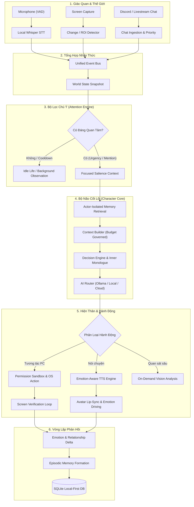

# VirtualCharacter: Local-First Embodied AI Character & AI VTuber Runtime
## Bản Định Hướng Kiến Trúc & Lộ Trình Phát Triển Dài Hạn (Master Vision & System Architecture)

> **Tài liệu tham chiếu**: [docs/plan.md](file:///d:/VirtualCharactor/docs/plan.md), [docs/tasks.md](file:///d:/VirtualCharactor/docs/tasks.md), [docs/contracts.md](file:///d:/VirtualCharactor/docs/contracts.md), [docs/dev_b_progress.md](file:///d:/VirtualCharactor/docs/dev_b_progress.md)  
> **Cấu hình máy mục tiêu**: Intel Core i5-12500H (12C/16T) | 32 GB RAM | NVIDIA RTX 3050 Laptop GPU (4 GB VRAM) | Windows 11  
> **Triết lý cốt lõi**: **Local-First + Optional Cloud Fallback** | **Character $\neq$ LLM** | **Embodied Autonomy** | **Event-Driven Adaptive Perception**

---

## 1. Tầm Nhìn Dự Án (Project Vision)

Dự án **VirtualCharacter** không nhằm mục đích tạo ra thêm một wrapper chatbot kết nối API thông thường. Mục tiêu tối thượng của VirtualCharacter là xây dựng một **Cognitive Runtime & Embodied AI Character System** hoàn toàn độc lập, mã nguồn mở, hoạt động cục bộ (Local-First) trên máy tính cá nhân.

Hệ thống lấy cảm hứng từ các thực thể AI VTuber tiên phong như **Neuro-sama** hay kiến trúc mở của **AIRI**, nhưng được xây dựng trên nền tảng kỹ thuật vững chắc bằng **Rust** cho tầng nhận thức, điều phối và xử lý luồng, kết hợp các runtime AI cục bộ (Ollama, whisper.cpp, Piper/Kokoro TTS, Live2D/VRM body controller).

### Khái Niệm Cốt Lõi: "Character không phải là LLM"
Trong kiến trúc của VirtualCharacter:
* **LLM (Large Language Model) chỉ là "Cơ quan Ngôn ngữ & Tư duy Bổ trợ" (Cognitive Sub-engine)** — tương tự thùy trán của não bộ.
* **Bản sắc nhân vật (Soul / Identity)** được định nghĩa bởi:
  $$\text{Character} = \text{Personality} + \text{Emotion} + \text{State} + \text{Relationship} + \text{Memory} + \text{Attention} + \text{Decision Engine}$$
* Nếu thay đổi mô hình bên dưới (ví dụ chuyển từ `Qwen2.5` sang `Llama-3`, `Gemma`, hoặc `Gemini`), nhân vật vẫn là **Aria** với toàn bộ ký ức, cảm xúc biến thiên, thái độ đối với từng người dùng và thói quen hành vi không hề bị xóa nhòa.

---

## 2. Định Nghĩa Sản Phẩm Cuối Cùng (Final Product Definition)

Sản phẩm hoàn thiện là một **Thực thể Nhân vật Ảo Hiện thân (Embodied AI Virtual Character / AI VTuber)** với 8 trụ cột chức năng:

1. **Bộ Não Nhận Thức (Brain)**: Quản lý bản sắc, hệ giá trị, cảm xúc 8 trục, quan hệ độc lập với từng cá nhân, suy nghĩ nội tâm (Inner Monologue).
2. **Ký Ức Đa Tầng Bền Vững (Multimodal Memory)**: Ký ức ngắn hạn, nhật ký sự kiện (Episodic), kho tri thức sự thật (Semantic) và niềm tin cốt lõi (Core), lưu trữ bằng SQLite + Vector Embeddings.
3. **Thị Giác Thích Ứng (Adaptive Vision)**: "Mắt" quan sát màn hình máy tính thông minh theo sự kiện (Event-driven / ROI change detection) thay vì chụp ảnh liên tục gây nghẽn phần cứng.
4. **Thính Giác Tức Thời (Hearing)**: "Tai" nghe người dùng qua Microphone bằng Voice Activity Detection (VAD) + Whisper STT cục bộ.
5. **Tiếng Nói Biểu Cảm (Voice)**: "Miệng" cất tiếng nói qua local TTS với cao độ, tốc độ và ngữ điệu biến thiên tự nhiên theo 8 trục cảm xúc (Valence/Arousal).
6. **Thân Thể Ảo (Body)**: Avatar 2D (Live2D) hoặc 3D (VRM) tự động chớp mắt, liếc nhìn (Look-at), cử động nhàn rỗi (Idle motion) và khẩu hình (Lip-sync) theo âm thanh thời gian thực.
7. **Bàn Tay Tương Tác (Hands / Computer Action)**: Khả năng tương tác với Windows (mở app, gõ phím, click, cuộn) dưới cơ chế cấp quyền nghiêm ngặt và vòng lặp xác minh thị giác (Screen Verification Loop).
8. **Đời Sống Xã Hội & Livestream (Social & Stream Life)**: Kết nối Discord, nhận diện người quen, đọc chat YouTube/Twitch/TikTok trong chế độ **Stream Mode** với bộ lọc spam và ưu tiên tương tác khán giả.

---

## 3. Đánh Giá Hiện Trạng Kiến Trúc (Current vs Reusable Architecture)

### 3.1. Những Gì Đã Hoàn Thành Tuyệt Vời (Phase 0 & 1 — Đạt 114/114 Tests Green)
Hiện tại, dự án đã xây dựng xong nền móng "bộ não" vững chắc nhất mà hiếm dự án mã nguồn mở nào có được:
* **`vc-core`**:
  * `personality`: Vector đặc trưng tính cách đa chiều, chuẩn mực Aria baseline.
  * `state`: Hệ cảm xúc 8 trục (*Joy, Sadness, Anger, Fear, Surprise, Affection, Embarrassment, Curiosity*), tính Valence/Arousal, phân rã hàm mũ (Exponential Decay), đồng bộ Cognitive & Behavior state.
  * `relationship`: Mô hình quan hệ hai chiều bipartite, 5 bậc quan hệ, cô lập tuyệt đối dữ liệu giữa các User (Skill 14).
  * `memory`: Cấu trúc 4 tầng ký ức, vòng đời củng cố/truy cập, bộ lọc truy vấn `MemoryQuery`.
  * `decision`: `RuleDecisionEngine` sinh ứng viên hành động và viết độc thoại nội tâm (*Inner Monologue*).
  * `context`: Gom ngữ cảnh đa nguồn, phân loại 4 cấp ưu tiên, cắt tỉa bảo đảm trần ngân sách `ContextBudget`.
* **`vc-storage`**:
  * 4 Repository traits: `CharacterRepository`, `StateRepository`, `RelationshipRepository`, `MemoryRepository`.
  * `InMemoryStorage` và `SqliteStorage` Local-First với chế độ WAL, lưu trữ bền vững trạng thái, cảm xúc và ký ức sống sót qua restarts.
* **`vc-runtime`**:
  * Vòng đời tương tác 9 bước (`RuntimeEngine`).
  * Quản lý phiên làm việc đa luồng an toàn (`SessionManager`).
* **`vc-llm`**:
  * Trait `LlmProvider` độc lập, tích hợp Google Gemini API có che giấu secret và `MockLlmProvider` kịch bản.
* **`apps/vc-server` & `apps/vc-cli` & `apps/vc-web`**:
  * Server Axum WebSocket streaming, CLI persistence và Mind Inspector HUD giao diện React.

### 3.2. Những Gì Có Thể Tái Sử Dụng Hoàn Toàn
Toàn bộ `vc-core`, `vc-storage` và `vc-runtime` hiện tại được giữ nguyên vẹn 100% ranh giới kiến trúc (Clean Architecture). Chúng ta chỉ **mở rộng (EXTEND)** các trait và module xung quanh chứ **tuyệt đối không REWRITE** đập bỏ.

### 3.3. Những Điểm Cần Bổ Sung / Tái Cấu Trúc Nhẹ
1. Thêm **Event Bus** trung tâm để điều phối sự kiện ngoại vi (Voice, Vision, Discord, Stream Chat).
2. Tích hợp **OllamaProvider** vào `vc-llm`.
3. Bổ sung **World Model** (WorldState) song song với CharacterState.
4. Bổ sung **Attention Engine** đứng trước Decision Engine để lọc thông tin thế giới.
5. Nâng cấp Memory sang Vector Embeddings cục bộ.
6. Xây dựng **Resource Manager** để giám sát và bảo vệ ngưỡng VRAM 4GB của RTX 3050.

---

## 4. Kiến Trúc Mục Tiêu Tổng Thể (Target System Architecture)

Hệ thống được tổ chức thành 6 lớp phân cấp nghiêm ngặt:

```
┌────────────────────────────────────────────────────────────────────────────────────────┐
│                                 LAYER 1: SENSORY & WORLD                               │
│  [Microphone / VAD]  [Screen Capture / Diff]  [Discord Bot]  [YouTube/Twitch Chat Stream] │
└───────────────────────────────────────────┬────────────────────────────────────────────┘
                                            │ Raw Perceptual Events
                                            ▼
┌────────────────────────────────────────────────────────────────────────────────────────┐
│                              LAYER 2: EVENT BUS & PERCEPTION                           │
│  ├── Unified Event Bus (Normalized Events)                                            │
│  ├── Local Whisper STT (CPU/GPU)                                                       │
│  ├── Level 1 & 2 Screen Sensing (Active Window, OCR, UI Elements)                      │
│  └── Stream Chat Ingestion (Spam Filter, Chat Priority Engine)                        │
└───────────────────────────────────────────┬────────────────────────────────────────────┘
                                            │ Normalized Perceptual Signals
                                            ▼
┌────────────────────────────────────────────────────────────────────────────────────────┐
│                           LAYER 3: ATTENTION & WORLD MODEL                             │
│  ├── WorldState (Active Window, User Status, Time, Stream Vibe, Sound Environment)     │
│  └── Attention Engine (Interest, Urgency, Cooldown, Curiosity, Social Context)         │
└───────────────────────────────────────────┬────────────────────────────────────────────┘
                                            │ Salient Context & Focus
                                            ▼
┌────────────────────────────────────────────────────────────────────────────────────────┐
│                           LAYER 4: COGNITIVE BRAIN (vc-core)                           │
│  ┌────────────────────────┐  ┌────────────────────────┐  ┌──────────────────────────┐  │
│  │   Personality Vector   │  │  8-Axis Emotion Engine │  │  Bipartite Relationship  │  │
│  └────────────────────────┘  └────────────────────────┘  └──────────────────────────┘  │
│  ┌──────────────────────────────────────────────────────────────────────────────────┐  │
│  │ Multi-Tier Memory (Core, Semantic Vector, Episodic, Working) + Sleep Worker       │  │
│  └──────────────────────────────────────────────────────────────────────────────────┘  │
│  ┌──────────────────────────────────────────────────────────────────────────────────┐  │
│  │ Context Builder & Budget Token Governor                                           │  │
│  └──────────────────────────────────────────────────────────────────────────────────┘  │
│  ┌──────────────────────────────────────────────────────────────────────────────────┐  │
│  │ Decision Engine (Action Evaluation, Inner Monologue, Behavior Policy)            │  │
│  └──────────────────────────────────────────────────────────────────────────────────┘  │
└───────────────────────────────────────────┬────────────────────────────────────────────┘
                                            │ Decided Action + Monologue
                                            ▼
┌────────────────────────────────────────────────────────────────────────────────────────┐
│                           LAYER 5: AI ROUTER & RESOURCE GOVERNOR                       │
│  ├── Resource Manager (RTX 3050 4GB VRAM Monitor, On-Demand Model Swapper)             │
│  ├── Model Registry (Capabilities: Text, Vision, Embeddings, Tools)                    │
│  └── AI Router:                                                                        │
│      ├── Local: Ollama (Qwen2.5 / Llama3.2), Local FastEmbed, Local Kokoro/Piper       │
│      └── Cloud Fallback: Google Gemini API (Text / Vision), ElevenLabs                 │
└───────────────────────────────────────────┬────────────────────────────────────────────┘
                                            │ Execution Directives & Audio Stream
                                            ▼
┌────────────────────────────────────────────────────────────────────────────────────────┐
│                             LAYER 6: EMBODIMENT & EXPRESSION                           │
│  ┌────────────────────────┐  ┌────────────────────────┐  ┌──────────────────────────┐  │
│  │ Voice/TTS Controller   │  │ Body Controller        │  │ Computer Action Executor │  │
│  │ (Emotion-aware speech) │  │ (Live2D / VRM / Lips)  │  │ (Permission, Verify Loop)│  │
│  └────────────────────────┘  └────────────────────────┘  └──────────────────────────┘  │
│  ┌──────────────────────────────────────────────────────────────────────────────────┐  │
│  │ Output Channels: OBS Virtual Cam / Audio Cable / Discord Voice / Web UI           │  │
│  └──────────────────────────────────────────────────────────────────────────────────┘  │
└────────────────────────────────────────────────────────────────────────────────────────┘
```

---

## 5. Kiến Trúc Bộ Não Nhận Thức (The Multi-Layer Cognitive Brain)

Sơ đồ dòng chảy tư duy của nhân vật được nâng cấp từ chu trình hiện tại:



---

## 6. Chiến Lược Tài Nguyên Phần Cứng Cho RTX 3050 Laptop (4GB VRAM)

Đây là **yếu tố sống còn** quyết định hệ thống có thể chạy mượt mà trên laptop của người dùng hay bị văng lỗi CUDA Out-Of-Memory (OOM).

### 6.1. Bảng Phân Bổ Tài Nguyên Nghiêm Ngặt (Resource Allocation Map)

| Thành phần | Thiết bị chạy | Mô hình đề xuất | Mức tiêu thụ VRAM | Mức tiêu thụ RAM | Đánh giá khả thi |
| :--- | :---: | :--- | :---: | :---: | :---: |
| **Hệ điều hành & Desktop** | GPU / OS | Windows DWM | ~0.6 GB | ~4.0 GB | Bắt buộc |
| **Rust Core & Runtime** | CPU | Native Rust binary | 0 GB | ~150 MB | Rất nhẹ `[LOCAL - LIGHT]` |
| **SQLite + Vector DB** | CPU | SQLite + HNSW/Vec | 0 GB | ~200 MB | Rất nhẹ `[LOCAL - LIGHT]` |
| **Chat Ingestion & Attention**| CPU | Heuristic Algorithms | 0 GB | ~50 MB | Rất nhẹ `[LOCAL - LIGHT]` |
| **STT (Nghe/Nhận diện giọng)**| **CPU (AVX2)** | `whisper.cpp` (base.en/small) | **0 GB** | ~500 MB | Chạy cực tốt trên i5-12500H |
| **TTS (Phát giọng nói)** | **CPU** | `Piper` / `Kokoro-82M` (ONNX) | **0 GB** | ~350 MB | Giọng đọc tự nhiên, 0 VRAM |
| **Avatar Body Controller** | GPU | Live2D WebGL / ThreeVRM | ~0.3 GB | ~400 MB | Nhẹ nhàng `[LOCAL - LIGHT]` |
| **Text Embeddings** | CPU | `bge-small-en/multilingual` | 0 GB | ~300 MB | Chạy CPU `[LOCAL - LIGHT]` |
| **Chính: Local Chat LLM** | **GPU** | `Qwen2.5-3B-Instruct-Q4_K_M` | **~2.2 GB** | ~2.0 GB | Vừa vặn 4GB VRAM! |
| **Phụ: Vision (On-Demand)** | GPU | `Moondream2` / `Qwen2-VL-2B` | *Hoán đổi VRAM* | ~2.0 GB | On-demand Swap / Cloud Fallback |

### 6.2. Cơ Chế Hoán Đổi Mô Hình Theo Nhu Cầu (On-Demand Model Swapping Protocol)
Để tránh tình trạng vừa nạp LLM 7B vừa nạp Vision 3B làm sập GPU 4GB:
1. **Trạng thái Mặc định (Chat / Companion Mode)**:
   * Giữ mô hình Chat `Qwen2.5-3B-Instruct` (2.2 GB VRAM) thường trực trong GPU.
   * STT, TTS, Embeddings, Memory, Logic hoàn toàn chạy trên 16 luồng của CPU i5 và 32GB RAM.
   * Mức chiếm dụng GPU ổn định: $0.6\text{ GB (Win)} + 0.3\text{ GB (Avatar)} + 2.2\text{ GB (LLM)} = 3.1\text{ GB / 4.0 GB}$ (An toàn tuyệt đối).
2. **Khi Kích Hoạt Tác Vụ Thị Giác Cục Bộ (Heavy Vision)**:
   * `ResourceManager` gửi tín hiệu tạm dừng luồng Chat.
   * Lựa chọn A (Khuyến nghị): Sử dụng **Vision Cloud Fallback** (gọi Gemini Vision API) nếu máy có internet $\rightarrow$ VRAM giữ nguyên 0 MB phụ trội.
   * Lựa chọn B (Offline Mode thuần túy): Ra lệnh Ollama unload Chat Model $\rightarrow$ nạp `Moondream2` (1.8 GB VRAM) để trích xuất ngữ cảnh màn hình thành văn bản $\rightarrow$ unload Vision $\rightarrow$ nạp lại Chat Model.

---

## 7. Kiến Trúc AI Cục Bộ (Ollama Integration, Model Registry & AI Router)

### 7.1. Trừu Tượng Hóa Provider Mở Rộng
Crate `vc-llm` được mở rộng với cấu trúc:
```
vc-llm/
├── src/
│   ├── provider.rs           # Trait LlmProvider, LlmRequest, LlmResponse
│   ├── router.rs             # AiRouter & dynamic routing policy
│   ├── registry.rs           # ModelRegistry, ModelCapability, ResourceProfile
│   ├── ollama/               # Ollama Native Adapter (localhost:11434)
│   │   ├── client.rs
│   │   └── types.rs
│   ├── gemini/               # Google Gemini REST Adapter
│   ├── openai_compatible/    # Chuẩn chung cho vLLM, LM Studio, Ollama OpenAI API
│   └── mock/                 # Mock testing
```

### 7.2. Hệ Thống Khả Năng Của Mô Hình (Model Capability System)
Mỗi mô hình trong `ModelRegistry` được khai báo metadata rõ ràng:
```rust
pub enum ModelCapability {
    TextGeneration,
    StructuredJson,
    ToolCalling,
    VisionPerception,
    Embedding,
}

pub struct ModelProfile {
    pub name: String,
    pub provider_type: ProviderType,
    pub capabilities: HashSet<ModelCapability>,
    pub context_limit: usize,
    pub estimated_vram_mb: usize,
    pub is_local: bool,
}
```

### 7.3. Bộ Định Tuyến AI (AI Router)
Mỗi yêu cầu từ `RuntimeEngine` sẽ đi qua `AiRouter` để quyết định backend xử lý:
* **Hội thoại thông thường** $\rightarrow$ `OllamaProvider` (`qwen2.5:3b-instruct-q4_K_M`).
* **Ký ức & Embeddings** $\rightarrow$ Local FastEmbed (CPU).
* **Nhận thức màn hình chi tiết** $\rightarrow$ Nếu có internet dùng `Gemini-1.5-Flash`; nếu offline dùng Local VLM theo cơ chế On-Demand.
* **Tác vụ suy luận phức tạp / Lập kế hoạch công cụ** $\rightarrow$ Tự động fallback sang Cloud nếu local model không hỗ trợ Function Calling.

---

## 8. Kiến Trúc Thị Giác Tự Nhiên & Thay Đổi Màn Hình (Natural Vision & Perception Loop)

> [!CAUTION]
> **Tuyệt đối cấm chụp màn hình 30 FPS rồi gửi cho LLM.** Đây là anti-pattern đốt sạch VRAM và CPU, làm máy tính giật lag khi chơi game.

VirtualCharacter áp dụng quy trình **Nhận Thức Màn Hình Thích Ứng (Event-Driven Adaptive Perception Loop)** qua 3 tầng:

```
[Màn Hình Người Dùng]
        │
        ▼ (Tầng 1: Win32 Hook / Desktop Duplication API - Siêu nhẹ, 0 VRAM)
[Level 1: Screen Sensing] ──> Phát hiện đổi Active Window / Tỉ lệ đổi Pixel (Visual Diff > 15%)
        │
        ▼ (Tầng 2: OCR & UI Tree Parsing - Chạy CPU)
[Level 2: Perception Engine] ──> Đọc Tiêu đề cửa sổ, UI Automation Elements, Text OCR nhanh
        │
        ▼
[Attention Engine] ──> "Có gì đáng chú ý không? (Game over? Lỗi ứng dụng? User gọi?)"
        │ 
        ├──> [KHÔNG] ──> Cập nhật WorldState, Im lặng quan sát.
        │
        └──> [CÓ] ──> Chụp đúng Vùng Trọng Tâm (ROI - Region of Interest)
                     │
                     ▼ (Tầng 3: Chỉ gọi khi thực sự cần hiểu sâu nghĩa)
             [Level 3: Vision Model Understanding]
             (Mô tả ngắn: "User vừa thua trận trong game do hết máu")
                     │
                     ▼
             [Đưa vào Context Builder -> Decision -> Voice Phản Ứng]
```

### Các Khối Thành Phần Của Vision Pipeline:
1. **`ScreenCaptureProvider`**: Sử dụng thư viện Rust Windows native (DirectX Desktop Duplication API / GDI capture) chụp ảnh khung hình cực nhanh (~5ms) chỉ khi có tín hiệu.
2. **`ChangeDetector`**: So sánh histogram và hash ma trận điểm ảnh độ phân giải thấp ($64 \times 64$) để phát hiện chuyển cảnh trên CPU mà không tốn tài nguyên.
3. **`PerceptionScheduler`**: Điều tiết tần suất quan sát:
   * Khi idle: 0 lần/phút (Ngủ hoàn toàn).
   * Khi xem video/học tập: 1 lần mỗi 30-60 giây hoặc khi đổi tab.
   * Khi chơi game cùng user: Tối đa 1 lần mỗi 5-10 giây tại vùng HUD game.
   * Khi user yêu cầu ("Xem màn hình hộ tôi"): Capture tức thời 1 lần duy nhất.

---

## 9. Tương Tác Máy Tính Có Kiểm Soát (Computer Use & Action Safety Sandbox)

Nhân vật có khả năng tương tác với Windows (mở app, gõ phím, click chuột) theo mô hình đại lý được giám sát nghiêm ngặt:

```
[Quyết Định Hành Động Từ LLM]
             │
             ▼
[Decision Engine: Action Proposal]
             │
             ▼
[Tool Planner & Risk Level Analyzer]
             │
 ┌───────────┴───────────┐
 │ Phân loại mức rủi ro  │
 └───────────┬───────────┘
             ├── Level 1 (An toàn): Mở app nghe nhạc, cuộn trang, xem giờ, click nút game đã cho phép
             │   └──> [Cho phép thực thi tự động]
             │
             └── Level 2 (Nguy hiểm): Xóa file, chạy terminal, gửi email, giao dịch, thao tác hệ thống
                 └──> [TẠM DỪNG -> Phát âm thanh hỏi User qua Voice: "Bạn có chắc muốn làm điều này?"]
                         │
                         ├──> User nói: "Không" -> Hủy bỏ action, ghi nhớ ranh giới.
                         └──> User nói: "Đồng ý" -> Cấp phép thực thi.
             │
             ▼
[OS Computer Tool (enigo / windows-rs)] -> Thực hiện Click / Type / Shortcut
             │
             ▼
[Screen Verification Loop] -> Chụp lại màn hình sau 300ms xác nhận kết quả
             │
             ▼
[Cập nhật Outcome vào Memory & State: "Đã mở thành công ứng dụng"]
```

### Các Module Bắt Buộc Trong Subsystem Máy Tính:
* **`ToolPermissionPolicy`**: Whitelist các ứng dụng được phép tương tác; Blacklist các thư mục hệ thống (`C:\Windows`, system registry, command shell nguy hiểm).
* **`ActionVerifier`**: Kiểm tra trạng thái UI sau hành động để đảm bảo click trúng đích, tránh tình trạng click nhầm liên tục gây lỗi.

---

## 10. Kiến Trúc Giọng Nói (Voice Pipeline: STT & TTS Tự Nhiên)

### 10.1. Thính Giác Cục Bộ (Voice Input — Hearing)
```
[Microphone] 
     │
     ▼
[Voice Activity Detector (Silero VAD / WebRTC VAD)] ──> Lọc bỏ tiếng ồn nền & im lặng
     │ (Chỉ khi phát hiện giọng người nói)
     ▼
[Audio Stream Buffer] 
     │
     ▼
[Local Whisper STT (whisper.cpp - CPU AVX2)] ──> Chuyển đổi thành văn bản
     │
     ▼
[Đưa vào Event Bus dưới dạng UserSpeechEvent]
```
* Hỗ trợ 2 chế độ:
  1. **Push-to-Talk**: Nhấn giữ phím tắt để nói (tiết kiệm 100% CPU khi không tương tác).
  2. **Wake-Word / Continuous**: Lắng nghe từ khóa đánh thức ("Aria ơi", "Hey Aria") với mô hình openWakeWord cực nhẹ trên CPU.

### 10.2. Phát Âm Có Cảm Xúc (Voice Output — Speaking)
Nhân vật không nói như một tổng đài tự động vô cảm. Crate `vc-voice` liên kết chặt chẽ với `EmotionState`:
* **`EmotionAwareVoiceModulator`**:
  * Khi `Joy > 0.7`: Tự động nâng Pitch $+8\%$, tăng Speed $+6\%$.
  * Khi `Sadness > 0.6`: Giảm Pitch $-5\%$, giảm Speed $-12\%$, tăng khoảng lặng giữa các câu.
  * Khi `Arousal cao (Hưng phấn/Kích động)`: Âm lượng tăng, nhịp điệu dứt khoát.
* **TTS Engine**:
  * Chạy cục bộ: Tích hợp **Piper TTS** hoặc **Kokoro-82M ONNX** trên CPU, độ trễ sinh âm thanh $< 200\text{ms}$.
  * Xuất ra Virtual Audio Cable để đưa thẳng vào **OBS Studio** hoặc **Discord Mic** khi livestream.

---

## 11. Hiện Thân Ảo (Avatar & Body Controller Architecture)

Avatar không được coi là một giao diện UI đơn thuần, mà là **Thân xác (Body)** của nhân vật:

```
[Character State] ─────────┐
(Emotion 8 trục, Mood)     │
                           ▼
[Speech State] ────> [Body Controller] ──> [Avatar Driver (Live2D / VRM)]
(Audio Phonemes, LipSync)  │                     │
                           │                     ├── Biểu cảm khuôn mặt (8 Emotion Axes)
[Attention State] ─────────┘                     ├── Khẩu hình Lip-sync theo âm thanh thời gian thực
(Look-at User / Screen)                          ├── Tự động chớp mắt & chuyển động nhàn rỗi (Auto Blink & Idle)
                                                 └── Chuyển động đầu theo hướng chú ý (Look-at target)
```

* **Live2D / VRM Abstraction**: Giao tiếp qua WebSocket hoặc IPC tới WebGL/Electron viewport, tương thích với các mô hình phổ biến hiện nay.
* **OBS Transparency**: Khung hình trong suốt có thể kéo thả trực tiếp làm nguồn Browser Source trong OBS Studio khi livestream.

---

## 12. Sự Tự Trị & Đời Sống Riêng Của Nhân Vật (Autonomy & Idle Life)

Một AI VTuber sống động không thể chỉ ngồi im bất động đợi lệnh người dùng. VirtualCharacter tích hợp **Hệ Thống Tự Trị & Chú Ý (Autonomy & Attention Engine)**:

```rust
pub struct AttentionScore {
    pub salience: f32,       // Mức độ nổi bật của sự kiện
    pub curiosity: f32,      // Mức độ tò mò dựa trên Personality
    pub emotional_pull: f32, // Tác động cảm xúc kéo sự chú ý
    pub cooldown_penalty: f32,// Trừ điểm nếu nhân vật vừa mới nói xong
}
```

### Các Hành Vi Khi Rảnh Rỗi (Idle Life Loop):
Khi không có ai nhắn tin trong một khoảng thời gian:
1. Nhân vật thực hiện animation nhàn rỗi (ngáp, nhìn quanh, nghiêng đầu).
2. Tự quan sát màn hình ở tần suất cực thấp (nếu người dùng đang chơi game hoặc xem phim, nhân vật thỉnh thoảng liếc nhìn).
3. Khi phát hiện tình huống bất ngờ (user thắng game, hoặc user ngồi im thở dài): Attention vượt ngưỡng $\rightarrow$ Nhân vật **chủ động mở lời trước**:
   * *"Trận đấu vừa rồi căng thẳng thật đấy, bạn có muốn nghỉ một lát không?"*
4. **Cơ chế chống nói dai (Anti-Chatter Cooldown)**: Giới hạn số lần chủ động mở lời, tránh gây phiền toái khi user đang tập trung làm việc.

---

## 13. Tích Hợp Đa Nền Tảng: Discord & Livestream Chat (Stream Mode)

### 13.1. Xe Buýt Sự Kiện Hợp Nhất (Unified Platform Event Bus)
Mọi tin nhắn từ bên ngoài đều được chuẩn hóa thành một schema sự kiện duy nhất trước khi đi vào bộ não:

```rust
pub struct PlatformChatMessage {
    pub platform: PlatformType, // Discord, YouTube, Twitch, TikTok, WebUI, CLI
    pub channel_id: String,
    pub user_id: String,
    pub username: String,
    pub content: String,
    pub is_direct_mention: bool,
    pub is_moderator: bool,
    pub timestamp: u64,
}
```
Nhờ đó, Character Runtime không cần biết chi tiết kỹ thuật của YouTube API hay Discord Gateway.

### 13.2. Bộ Lọc Trí Tuệ Cho Livestream (Stream Chat Intelligence)
Trong chế độ **Stream Mode**, livestream có thể nhận 500 tin nhắn/phút. Crate `vc-integrations` tích hợp:
1. **Spam & Emoji Filter**: Gộp các tin nhắn trùng lặp ("hello", "gg", emoji spam).
2. **Chat Priority Scorer**:
   * Tin nhắn SuperChat / Ủng hộ: Ưu tiên tối đa (Priority 1.0).
   * User thân quen (dựa trên `RelationshipRepository`): Cộng điểm ưu tiên (Relationship Boost).
   * Câu hỏi thú vị / kích thích tính cách tò mò: Cộng điểm ưu tiên.
3. **Chat Aggregator**: Gom 10 câu hỏi cùng chủ đề để nhân vật trả lời 1 lần duy nhất trước stream:
   * *"Nhiều bạn trên kênh đang hỏi về dự án mới, mình xin chia sẻ là..."*

---

## 14. Hệ Thống Bộ Nhớ 2.0 (Vector Embeddings & Ký Ức Trong Giấc Ngủ)

Nâng cấp hệ thống Memory từ Phase 1 thành kiến trúc hoàn thiện:

```
[Working Memory (Ngắn hạn)] ──> Lưu trữ context vài turn chat gần nhất
           │
           ▼ (Cuối phiên tương tác)
[Episodic Memory (Nhật ký sự kiện)] ──> Lưu chi tiết từng sự kiện vừa diễn ra
           │
           ▼ (Chạy ngầm khi nhân vật Idle / Ban đêm - "Giấc Ngủ")
[Sleep & Consolidation Worker]
   ├── Gọi LLM cục bộ tóm tắt các Episodic rời rạc thành 1 sự thật cô đọng
   ├── Tạo Vector Embeddings (FastEmbed bge-small)
   ├── Lưu vào [Semantic Memory] (Kho tri thức & bài học)
   └── Xóa bớt hoặc đánh dấu phân rã (Decay) các chi tiết vụn vặt không quan trọng
           │
           ▼
[Core Memory] ──> Các sự thật nền tảng không bao giờ bị quên
```

* **Xử lý mâu thuẫn ký ức (Memory Conflict Resolution)**: Khi người dùng cập nhật thông tin mới (VD: "Mình vừa chuyển sang dùng Linux thay vì Windows"), hệ thống tự động đánh dấu thông tin cũ là *Deprecated* và lưu thông tin mới.

---

## 15. Lộ Trình Phát Triển Mới (The Reorganized Phase Roadmap)

Kế hoạch phát triển được sắp xếp lại một cách thực tế, tôn trọng phần cứng RTX 3050 4GB và xây dựng từng nấc thang từ lõi ra vỏ:

```
┌──────────────────────────────────────────────────────────────────────────────────┐
│ [ĐÃ XONG] Phase 0: Architecture Bootstrap & Multi-Crate Workspace                │
│ [ĐÃ XONG] Phase 1: Cognitive Core + 8-Axis Emotion + Local SQLite Persistence    │
└────────────────────────────────────────┬─────────────────────────────────────────┘
                                         │
                                         ▼
┌──────────────────────────────────────────────────────────────────────────────────┐
│ PHASE 2: LOCAL AI BRAIN & MEMORY 2.0                                             │
│ - Tích hợp OllamaProvider (qwen2.5:3b) & Local FastEmbeddings                    │
│ - Vector Search Semantic Memory trong SQLite                                      │
│ - Resource Manager giám sát VRAM 4GB                                             │
│ - Memory Sleep & Consolidation Background Worker                                 │
└────────────────────────────────────────┬─────────────────────────────────────────┘
                                         │
                                         ▼
┌──────────────────────────────────────────────────────────────────────────────────┐
│ PHASE 3: VOICE & AUDITORY PRESENCE (NGHE & NÓI)                                  │
│ - Local Whisper STT (whisper.cpp trên CPU với VAD)                               │
│ - Emotion-Aware TTS Engine (Piper / Kokoro 82M trên CPU)                         │
│ - Audio Cable Output Pipeline & Push-to-Talk                                     │
└────────────────────────────────────────┬─────────────────────────────────────────┘
                                         │
                                         ▼
┌──────────────────────────────────────────────────────────────────────────────────┐
│ PHASE 4: EMBODIED AVATAR & BODY CONTROLLER                                       │
│ - Live2D / VRM Viewport Integration                                              │
│ - Realtime Audio Lip-Sync & Auto Blinking                                        │
│ - Facial Expression Driving từ 8 trục cảm xúc                                    │
│ - OBS Transparent Browser Source                                                 │
└────────────────────────────────────────┬─────────────────────────────────────────┘
                                         │
                                         ▼
┌──────────────────────────────────────────────────────────────────────────────────┐
│ PHASE 5: WORLD MODEL, ATTENTION & ADAPTIVE VISION                                │
│ - WorldState Tracker (Active Window, Time, Environment)                          │
│ - Attention Engine (Salience, Curiosity, Cooldown) & Autonomy Idle Life          │
│ - Level 1 & 2 Screen Sensing (ROI change detection, UI element parsing)          │
│ - On-Demand Level 3 Vision (Moondream2 / Gemini Vision Fallback)                 │
└────────────────────────────────────────┬─────────────────────────────────────────┘
                                         │
                                         ▼
┌──────────────────────────────────────────────────────────────────────────────────┐
│ PHASE 6: CONTROLLED COMPUTER USE (BÀN TAY TƯƠNG TÁC)                             │
│ - Computer Tools (App open, click, type, scroll, shortcut)                       │
│ - Action Safety Sandbox & Confirmation Layer                                     │
│ - Screen Verification Feedback Loop                                              │
└────────────────────────────────────────┬─────────────────────────────────────────┘
                                         │
                                         ▼
┌──────────────────────────────────────────────────────────────────────────────────┐
│ PHASE 7: UNIFIED PLATFORM INTEGRATIONS (DISCORD BOT)                             │
│ - Unified Platform Event Bus                                                     │
│ - Discord Adapter: đọc/phản hồi chat, nhận diện User, quan hệ riêng biệt         │
└────────────────────────────────────────┬─────────────────────────────────────────┘
                                         │
                                         ▼
┌──────────────────────────────────────────────────────────────────────────────────┐
│ PHASE 8: AI VTUBER STREAM RUNTIME (LIVESTREAM MODE)                              │
│ - YouTube & Twitch Chat Adapters                                                 │
│ - Chat Ingestion, Spam Filtering & Chat Priority Engine                          │
│ - Stream Director: Quản lý nhịp điệu buổi live, tương tác khán giả liên tục     │
└────────────────────────────────────────┬─────────────────────────────────────────┘
                                         │
                                         ▼
┌──────────────────────────────────────────────────────────────────────────────────┐
│ PHASE 9+: ADVANCED ECOSYSTEM & CONTINUOUS LEARNING                               │
│ - Multi-Character Profiles (Chuyển đổi Aria, Hikari, Lyra...)                    │
│ - Offline Learning from Interaction Datasets                                     │
│ - Multi-Agent / NPC-to-NPC Conversations                                         │
└──────────────────────────────────────────────────────────────────────────────────┘
```

---

## 16. Ma Trận Đánh Giá Tính Năng Theo Khả Năng Của RTX 3050 4GB

| Tính năng | Phân loại phần cứng | Chiến lược triển khai |
| :--- | :---: | :--- |
| **Rust Character Core & Storage** | `[LOCAL - LIGHT]` | Chạy 100% CPU/RAM, tiêu thụ $< 200\text{MB}$. Hoàn toàn không tốn VRAM. |
| **Embedding & Vector Search** | `[LOCAL - LIGHT]` | Chạy mô hình `bge-small` hoàn toàn trên CPU với thư viện FastEmbed. |
| **STT (Nghe tiếng người dùng)** | `[LOCAL - LIGHT]` | Chạy `whisper.cpp` (Small/Base) trên 16 luồng CPU với lệnh AVX2. |
| **TTS (Phát âm có cảm xúc)** | `[LOCAL - LIGHT]` | Chạy Piper/Kokoro ONNX trên CPU, phản hồi tức thì $< 200\text{ms}$. |
| **Chat LLM Cục Bộ** | `[LOCAL - POSSIBLE]` | Chạy `Qwen2.5-3B-Instruct-Q4_K_M` trên GPU, chiếm đúng ~2.2 GB VRAM. |
| **Live2D / VRM Avatar** | `[LOCAL - LIGHT]` | Render WebGL qua GPU nhẹ nhàng, chiếm ~300 MB VRAM. |
| **Screen Sensing (Tầng 1 & 2)** | `[LOCAL - LIGHT]` | Chụp ảnh Win32 & diff điểm ảnh hoàn toàn trên CPU. |
| **VLM Deep Understanding (Tầng 3)**| `[LOCAL - HEAVY]` | Chỉ nạp on-demand khi thực sự cần, hoặc ưu tiên dùng **Cloud Fallback** (Gemini). |
| **LLM 7B / 14B Context Dài** | `[UPGRADE PHASE]` | Dành cho máy có GPU $\ge 8\text{GB}$ VRAM; trên máy này ưu tiên chạy qua Cloud Fallback. |

---

## 17. Phân Tích Rủi Ro Kỹ Thuật & Giải Pháp

1. **Rủi ro văng bộ nhớ GPU (VRAM OOM Crash)**:
   * *Nguyên nhân*: Chạy đồng thời Ollama + Whisper GPU + Live2D + game nặng.
   * *Giải pháp*: Thiết kế cứng trong `ResourceManager`: Đẩy STT và TTS sang CPU. Khóa trần VRAM cho Ollama tối đa 2.5 GB.
2. **Rủi ro nhân vật nói nhảm liên tục (Chatter Spurt)**:
   * *Nguyên nhân*: Vòng lặp tự trị liên tục kích hoạt phát biểu khi màn hình có biến động nhỏ.
   * *Giải pháp*: `AttentionEngine` áp dụng điểm phạt hồi chiêu (*Cooldown Penalty*). Sau mỗi lần nói, nhân vật bắt buộc im lặng tối thiểu 15-30 giây trừ khi user trực tiếp gọi tên.
3. **Rủi ro an toàn máy tính (Unauthorized Computer Actions)**:
   * *Nguyên nhân*: LLM sinh ảo giác gõ lệnh phá hoại hệ thống.
   * *Giải pháp*: Cấm tuyệt đối quyền chạy cmd/powershell tùy ý. Chỉ cấp quyền gọi các hành động click/type trong danh sách trắng cửa sổ ứng dụng được phê duyệt.
4. **Rủi ro rò rỉ khóa API / Dữ liệu riêng tư**:
   * *Nguyên nhân*: Đưa API key hoặc dữ liệu nhạy cảm vào git/log.
   * *Giải pháp*: Kế thừa chuẩn che giấu secret `[REDACTED]` (Skill 20/25) đã kiểm thử thành công trong Phase 1.

---

## 18. Tiêu Chí Hoàn Thành (Definition of Done) Cho Các Phase Tới

Một Phase mới chỉ được coi là hoàn tất khi:
1. **Kiến trúc phân tầng được bảo toàn**: Không import thư viện bên ngoài hay API cloud trực tiếp vào `vc-core`.
2. **Chạy được Offline**: Có ít nhất một luồng hoạt động hoàn toàn cục bộ không cần internet.
3. **Bộ nhớ VRAM kiểm soát nghiêm ngặt**: Không vượt quá 3.5 GB VRAM trên RTX 3050 trong mọi kịch bản thông thường.
4. **Kiểm thử tự động phủ kín**: Viết unit tests và integration tests với mock provider, đảm bảo `cargo test --workspace` luôn đạt 100% pass trước khi merge.
5. **Đồng bộ tài liệu**: Cập nhật tiến độ vào [docs/dev_b_progress.md](file:///d:/VirtualCharactor/docs/dev_b_progress.md) và [docs/checklist.md](file:///d:/VirtualCharactor/docs/checklist.md).
